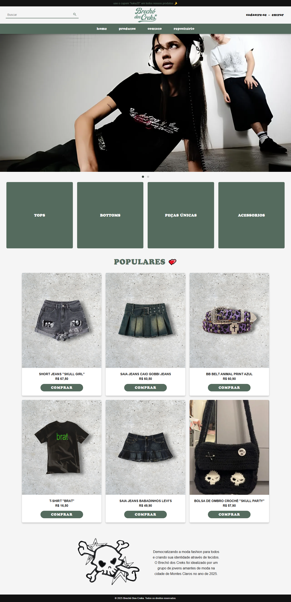

# 🎩 — 𝕭𝖗𝖊𝖈𝖍𝖔 𝖉𝖔𝖘 𝕮𝖗𝖊𝖐𝖘

Um site criado para desenvolver habilidades de **front-end** que simula um brechó online de roupas.

---

## 👀 — 𝕻𝖗𝖊𝖛𝖎𝖊𝖜 𝖉𝖔 𝕾𝖎𝖙𝖊



O site se inspira no brechó **[Brechó Gertrudez](https://www.brechogertrudez.com.br/)** e na marca de roupa **[Golf Le Fleur](https://golflefleur.com/?srsltid=AfmBOopc7-xqT_fAwvzVeUFdTqbgb5Kpybf0QELhgu4IWsc4ao6dJ3_6)**, isto é, ***TODA*** propriedade intelectual relacionada a design pertence a essas duas empresas. ***O site serve como uma homenagem à criatividade dos designers e idealizadores envolvidos nestes projetos***.

---

## 📂 — 𝕰𝖘𝖙𝖗𝖚𝖙𝖚𝖗𝖆 𝖉𝖔 𝕻𝖗𝖔𝖏𝖊𝖙𝖔

- **index.html** → Página inicial
- **style.css** → Estilização de TODO o site
- **/pages** → Paginas do site
   - **produtos.html** → Lista de produtos  
   - **cadastro.html** → Cadastro de novos usuários  
   - **login.html** → Página de login  
   - **contato.html** → Formulário de contato  
   - **emdev.html** → Página placeholder  
   - **style.css** → Estilização principal  
- **/img** → Imagens do site
   - **brecho_creks.png** → Logo do site (feito por IA e usando a logo da GOLF le FLEUR* como inspiração)
   - **preview_creks.png** → Print de toda a página inicial.
   - **sobrenos_img** → Imagem usada na seção Sobre Nós
- **/icons** → Ícones utilizados
   - **pesquisa.svg** → Ícone vetorial para barra de pesquisa
   - **usericon.png** → Ícone de usuário utilizado no "**login.html**" e no "**cadastro.html**"
- **/fonts** → Fonte personalizada
   - **CooperFiveOpti-Black.otf** → Fonte personalizada usada na maior parte do site.

---

## 💻 — 𝕿𝖊𝖈𝖓𝖔𝖑𝖔𝖌𝖎𝖆𝖘 𝖀𝖙𝖎𝖑𝖎𝖟𝖆𝖉𝖆𝖘
 

---

## 🧠 — 𝕮𝖔𝖒𝖔 𝖚𝖘𝖆𝖗

1. Clone este repositório:
   ```bash
   git clone https://github.com/seu-usuario/brecho_dos_creks.git
   ```
2. Acesse a pasta referente ao repositório:
   ```bash
   cd brecho_dos_creks
   ```
3. Abra o arquivo `index.html` no seu navegador.
4. Aproveite :)

---

## 🔮— 𝕸𝖊𝖑𝖍𝖔𝖗𝖎𝖆𝖘 𝖖𝖚𝖊 𝖛𝖎𝖗𝖆𝖔

- Melhor responsividade para telas maiores e para celulares;
- Back-end que torne o site interativo;
- Banco de dados que torne o site funcional;
- Criar componentização (header/footer reaproveitáveis);
- Melhorar acessibilidade.

---

## 🧛‍♂️ — 𝕬𝖚𝖙𝖔𝖗

Feito com muito <3 por mim, **Erick / Kekel**, inspirado pelo **[Brechó Gertrudez](https://www.brechogertrudez.com.br/)** e **[Golf Le Fleur](https://golflefleur.com/?srsltid=AfmBOopc7-xqT_fAwvzVeUFdTqbgb5Kpybf0QELhgu4IWsc4ao6dJ3_6)**. ༼ つ ◕_◕ ༽つ
